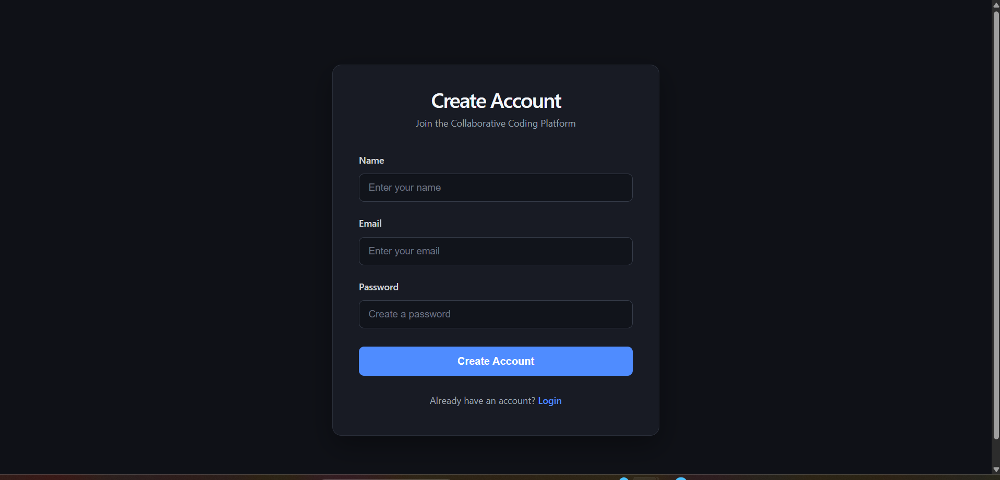
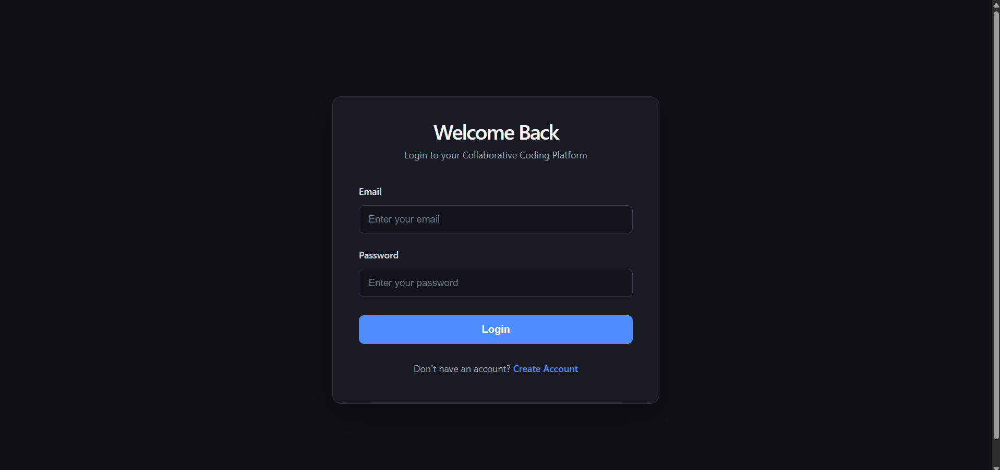
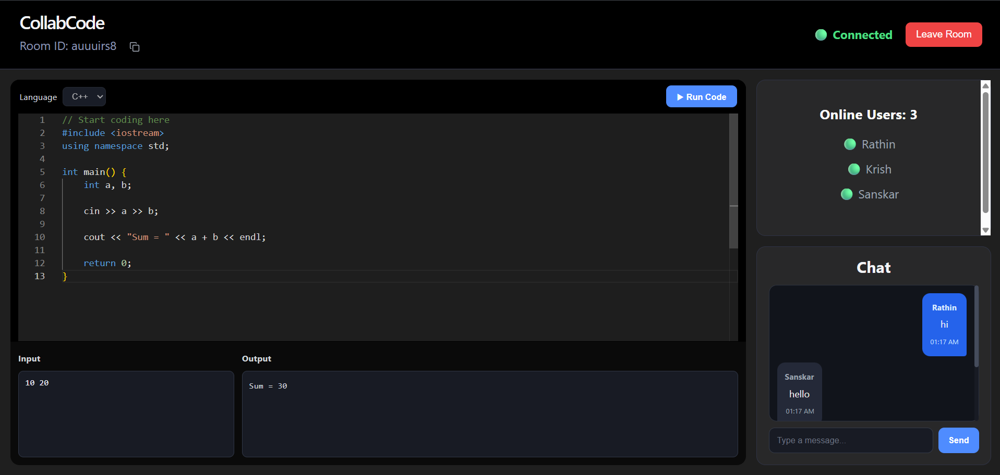

# 🚀 CollabCode

A full-stack **real-time collaborative coding platform** that allows multiple authenticated users to work together in a shared coding room. Users can collaboratively edit code, communicate through real-time chat, see active participants, execute C++ programs, and persist room code and chat history using MongoDB.

---

## ✨ Features

- 🔐 JWT-based user authentication (Signup & Login)
- 🛡️ Protected routes for authenticated users
- 💻 Real-time collaborative code editing using Monaco Editor
- ⚡ Instant code synchronization using Socket.IO
- 👥 Live online-user presence tracking
- 🚪 Explicit room leave handling
- 💬 Real-time chat within collaboration rooms
- 💾 Automatic code persistence using MongoDB
- 📝 Automatic chat history persistence
- 🔄 Restore previously saved code and chat history when rejoining a room
- ▶️ C++ code execution
- ⌨️ Custom program input support
- 📤 Program output display
- ❌ Compilation error handling
- ⏱️ Execution timeout handling
- 📋 One-click room ID copying
- 🎨 Responsive dark-themed UI

---

## 🛠️ Tech Stack

### Frontend

- React.js
- React Router
- Context API
- Axios
- Socket.IO Client
- Monaco Editor
- Lucide React
- CSS

### Backend

- Node.js
- Express.js
- Socket.IO
- JWT (JSON Web Token)
- bcrypt
- Child Process API
- C++ / g++

### Database

- MongoDB Atlas
- Mongoose

---

## 🏗️ Architecture

CollabCode uses both **HTTP APIs** and **WebSockets**, depending on the functionality.

### Authentication Flow

```text
React Client
     ↓
Express API
     ↓
Auth Routes
     ↓
Auth Controller
     ↓
MongoDB
     ↓
JWT
```

### Real-Time Collaboration Flow

```text
User A ─────┐
            │
User B ─────┼──→ Socket.IO Server
            │          ↓
User C ─────┘        Room
                     ↓
              Code / Chat / Presence
```

### Code Execution Flow

```text
Monaco Editor
     ↓
Run Code
     ↓
POST /api/run
     ↓
Code Controller
     ↓
C++ Execution Service
     ↓
g++ Compilation
     ↓
Program Execution
     ↓
Output / Error / Timeout
     ↓
React UI
```

---

## 📁 Project Structure

```text
collab-code-platform/
│
├── client/
│   ├── public/
│   │
│   ├── src/
│   │   ├── assets/
│   │   │
│   │   ├── components/
│   │   │   ├── BottomSection.jsx
│   │   │   ├── Chat.jsx
│   │   │   ├── Editor.jsx
│   │   │   ├── OnlineUsers.jsx
│   │   │   ├── ProtectedRoute.jsx
│   │   │   └── RoomHeader.jsx
│   │   │
│   │   ├── context/
│   │   │   └── AuthContext.jsx
│   │   │
│   │   ├── pages/
│   │   │   ├── Home.jsx
│   │   │   ├── Login.jsx
│   │   │   ├── Room.jsx
│   │   │   └── Signup.jsx
│   │   │
│   │   ├── services/
│   │   │   └── authService.js
│   │   │
│   │   ├── socket/
│   │   │   └── socket.js
│   │   │
│   │   ├── styles/
│   │   │   ├── BottomSection.css
│   │   │   ├── Chat.css
│   │   │   ├── Editor.css
│   │   │   ├── Header.css
│   │   │   ├── Home.css
│   │   │   ├── Login.css
│   │   │   ├── OnlineUsers.css
│   │   │   ├── Room.css
│   │   │   └── Signup.css
│   │   │
│   │   ├── App.css
│   │   ├── App.jsx
│   │   ├── index.css
│   │   └── main.jsx
│   │
│   ├── .gitignore
│   ├── eslint.config.js
│   ├── index.html
│   ├── package.json
│   ├── package-lock.json
│   └── vite.config.js
│
├── server/
│   ├── config/
│   │   └── db.js
│   │
│   ├── controllers/
│   │   ├── authController.js
│   │   └── codeController.js
│   │
│   ├── middleware/
│   │   └── authMiddleware.js
│   │
│   ├── models/
│   │   ├── Room.js
│   │   └── User.js
│   │
│   ├── routes/
│   │   ├── authRoutes.js
│   │   └── codeRoutes.js
│   │
│   ├── services/
│   │   └── codeExecutor.js
│   │
│   ├── .env
│   ├── package.json
│   ├── package-lock.json
│   └── server.js
│
├── .gitignore
└── README.md
```

---

## ⚙️ Installation

### Clone the repository

```bash
git clone <repository-url>
cd collab-code-platform
```

### Install frontend dependencies

```bash
cd client
npm install
```

### Install backend dependencies

```bash
cd ../server
npm install
```

---

## 🔑 Environment Variables

Create a `.env` file inside the **server** directory.

```env
PORT=5000

MONGODB_URI=your_mongodb_connection_string

JWT_SECRET=your_secret_key
```

Never commit your `.env` file or expose your database credentials publicly.

---

## ▶️ Run the Project

### Start the backend

```bash
cd server
node server.js
```

Backend:

```text
http://localhost:5000
```

### Start the frontend

Open another terminal:

```bash
cd client
npm run dev
```

Frontend:

```text
http://localhost:5173
```

---

## 💻 Code Execution

CollabCode currently supports C++ code execution.

Users can:

- Write C++ code using Monaco Editor
- Provide custom input
- Compile and execute the program
- View program output
- View compilation errors
- Handle runtime failures
- Detect programs that exceed the execution time limit

### Example

```cpp
#include <iostream>
using namespace std;

int main() {
    int a, b;

    cin >> a >> b;

    cout << a + b;

    return 0;
}
```

Input:

```text
10 20
```

Output:

```text
30
```

---

## 🔄 Real-Time Collaboration

Multiple users can join the same room using a shared Room ID.

For example:

```text
Room ID: gk3d9rtt
```

Users inside the room can:

- Edit the same code simultaneously
- See other connected users
- Exchange chat messages
- Leave the room explicitly
- Receive updated room state in real time

Socket.IO is used for real-time communication between clients and the server.

---

## 💾 Data Persistence

MongoDB stores:

### Users

- Name
- Email
- Hashed password
- Timestamps

### Rooms

- Room ID
- Current code
- Chat messages
- Timestamps

When a user rejoins a room, previously saved code and chat history are restored.

---

## 🔐 Authentication & Security

CollabCode uses:

- JWT for authentication
- bcrypt for password hashing
- Protected frontend routes
- Server-side JWT verification
- Socket.IO authentication using JWT
- Password exclusion when retrieving user profiles

The code execution service also applies execution and output limits.

The current C++ execution system is intended for local development. Running arbitrary user code in a production environment requires stronger sandboxing and process isolation.

---

## 🧪 Testing

The project has been tested with multiple simultaneous users using separate browser sessions.

Tested scenarios include:

- ✅ Multiple users joining the same room
- ✅ Real-time user presence
- ✅ User leaving a room
- ✅ Real-time code synchronization
- ✅ Real-time chat
- ✅ Persistent code and chat history
- ✅ C++ execution
- ✅ Program input/output
- ✅ Compilation errors
- ✅ Execution timeout

---

## 🚀 Future Enhancements

- 🌐 Support for additional programming languages such as Python and Java
- 📁 File sharing
- 👆 Live cursor and selection tracking
- 🧑‍🤝‍🧑 Improved collaborative editing using CRDT/Operational Transform
- 🐳 Container-based secure code execution
- 🌐 Production deployment
- 📹 Video/voice collaboration
- 🌙 Light/Dark theme switching
- 📊 Code execution history

---

## 📸 Screenshots

### 📝 Signup



### 🔐 Login



### 💻 Collaborative Coding Room



---

## 👨‍💻 Author

**Rathin Kamble**

B.Tech Computer Science & Engineering  
Walchand College of Engineering, Sangli